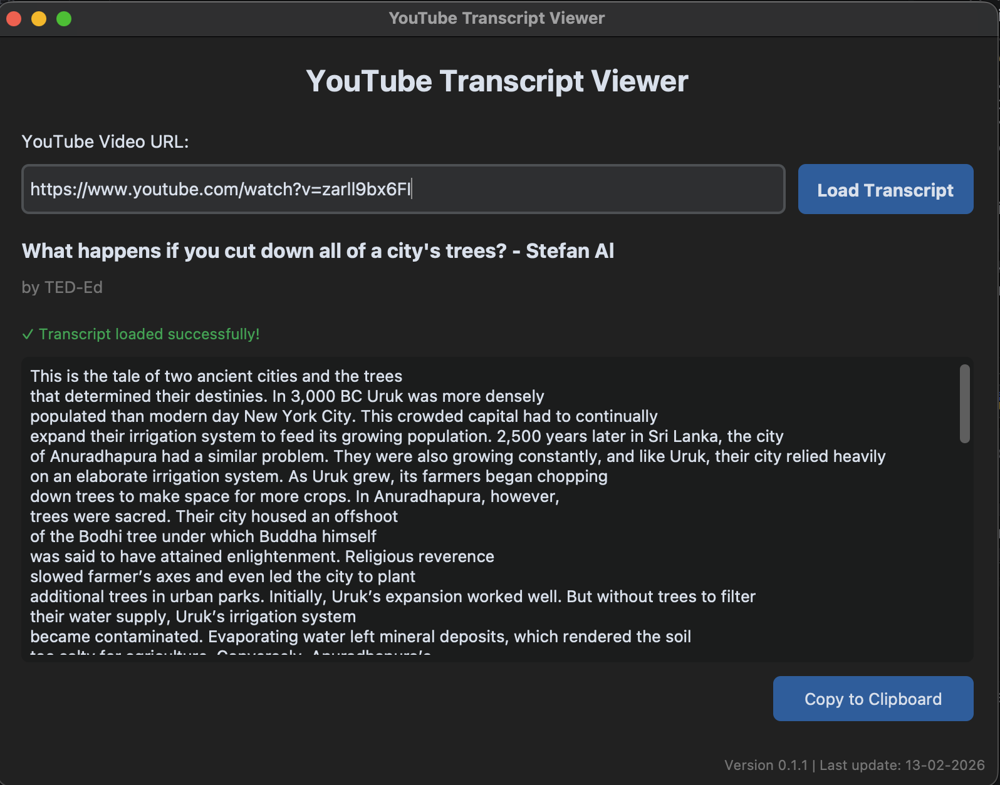

# YouTube Transcript Viewer

A simple desktop application to extract and view transcripts from any YouTube video. Just paste the URL and get the transcript instantly.

**✅ No API required — No API key needed — Ready to use!**



## Requirements

- Python 3.13+
- uv (package manager)

## Install Dependencies

```bash
uv sync
```

## Run

```bash
uv run python main.py
```

## Build for Windows 64-bit

To create a `.exe` executable for Windows 64-bit, run this command **from a Windows machine**:

```bash
uv run pyinstaller youtube_transcript.spec
```

The executable will be created in the `dist/YouTubeTranscriptViewer.exe` folder.

### Notes on Cross-Compilation

PyInstaller **does not support cross-compilation**. To create a Windows `.exe` you must:

1. Use a Windows machine (physical or virtual)
2. Install Python 3.13+ and uv
3. Clone this project
4. Run `uv sync` to install dependencies
5. Run the build command above

### Alternative Build (Direct Command)

If you prefer not to use the `.spec` file, you can use this command:

```bash
uv run pyinstaller --onefile --windowed --name YouTubeTranscriptViewer --collect-data customtkinter main.py
```

## Usage

1. Launch the application
2. Paste a YouTube video URL in the text field
3. Click "Load Transcript"
4. The transcript will appear in the text area below

## Dependencies

- **customtkinter**: Modern GUI based on tkinter
- **youtube-transcript-api**: API to fetch YouTube transcripts
- **pyinstaller**: Tool to create standalone executables
